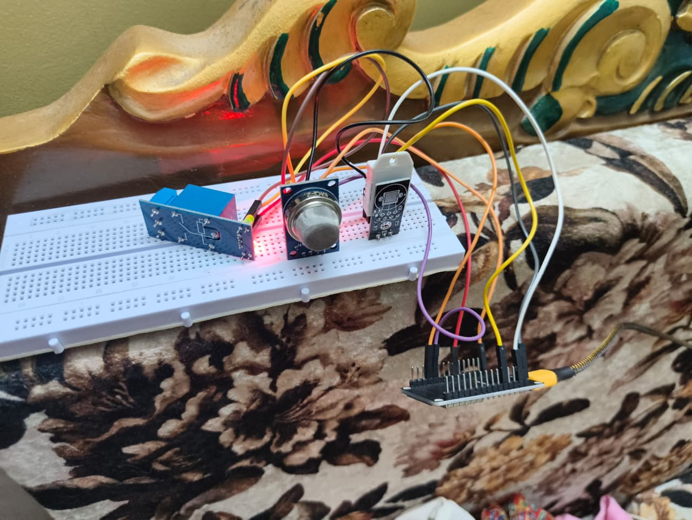

# 🌤️ Smart Weather Monitoring System

Real-time IoT-based weather monitoring system using ESP32 
and ThingSpeak cloud dashboard.

## 📡 Features
- Real-time Temperature & Humidity monitoring (DHT22)
- Air Quality monitoring (MQ135)
- Automatic relay control based on thresholds
- Live cloud dashboard on ThingSpeak

## 🔧 Hardware Used
| Component | Purpose |
|-----------|---------|
| ESP32 | Main microcontroller + WiFi |
| DHT22 | Temperature & Humidity |
| MQ135 | Air Quality sensor |
| Relay Module | Auto fan/exhaust control |

## 📌 Circuit Connections
| Sensor | ESP32 Pin |
|--------|-----------|
| DHT22 DATA | GPIO 4 |
| MQ135 AOUT | GPIO 34 |
| Relay IN | GPIO 26 |

## ☁️ ThingSpeak Dashboard
Live data → https://thingspeak.com/channels/3418062

## 🛠️ Libraries Required
- DHT sensor library (Adafruit)
- Adafruit Unified Sensor
- ThingSpeak (MathWorks)

## ⚙️ Setup
1. Install Arduino IDE + ESP32 board package
2. Install required libraries
3. Add your WiFi credentials and ThingSpeak API key
4. Upload code to ESP32

## 📸 Project Setup

